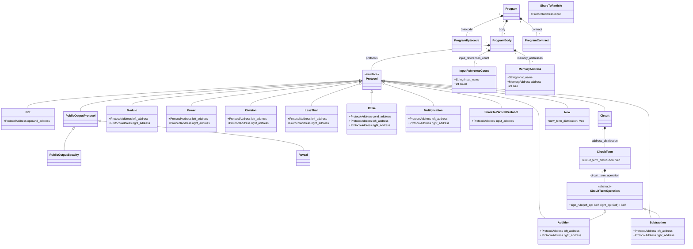

```mermaid
classDiagram

    Program "1" *-- "1" ProgramBytecode: bytecode
    Program "1" *-- "1" ProgramBody: body
    Program "1" *-- "1" ProgramContract: contract

    ProgramBody "1" *-- "*" Protocol: protocols
    ProgramBody "1" *-- "*" InputReferenceCount: input_references_count
    ProgramBody "1" *-- "*" MemoryAddress: memory_addresses

    class MemoryAddress {
        +String input_name
        +MemoryAddress address
        +int size
    }

    class InputReferenceCount {
        +String input_name
        +int count
    }

    class Protocol {
        <<interface>>
    }

    Protocol <|-- Not
    Protocol <|-- Circuit
    Protocol <|-- Modulo
    Protocol <|-- Power
    Protocol <|-- Division
    Protocol <|-- LessThan
    Protocol <|-- IfElse
    Protocol <|-- Addition
    Protocol <|-- Subtraction
    Protocol <|-- Multiplication
    Protocol <|-- ShareToParticleProtocol
    Protocol <|-- PublicOutputProtocol
    PublicOutputProtocol <|-- PublicOutputEquality
    PublicOutputProtocol <|-- Reveal
    Protocol <|-- New

    class Not {
        +ProtocolAddress operand_address
    }

    class Modulo {
        +ProtocolAddress left_address
        +ProtocolAddress right_address
    }

    class Power {
        +ProtocolAddress left_address
        +ProtocolAddress right_address
    }

    class Division {
        +ProtocolAddress left_address
        +ProtocolAddress right_address
    }

    class LessThan {
        +ProtocolAddress left_address
        +ProtocolAddress right_address
    }

    class IfElse {
        +ProtocolAddress cond_address
        +ProtocolAddress left_address
        +ProtocolAddress right_address
    }

    class Addition {
        +ProtocolAddress left_address
        +ProtocolAddress right_address
    }

    class Subtraction {
        +ProtocolAddress left_address
        +ProtocolAddress right_address
    }

    class Multiplication {
        +ProtocolAddress left_address
        +ProtocolAddress right_address
    }

    class ShareToParticleProtocol {
        +ProtocolAddress input_address
    }

    class New {
        +new_term_distribution: Vec<MemoryAddress>
    }

    class ShareToParticle {
        +ProtocolAddress input
    }

    Circuit "1" *-- "*" CircuitTerm: address_distribution

    class CircuitTerm {
        +circuit_term_distribution: Vec<MemoryAddress>
    }

    CircuitTerm "1" *-- "*" CircuitTermOperation: circuit_term_operation

    class CircuitTermOperation {
        <<abstract>>
        +sign_rule(left_op: Self, right_op: Self) Self
    }

    CircuitTermOperation <|-- Addition
    CircuitTermOperation <|-- Subtraction

```